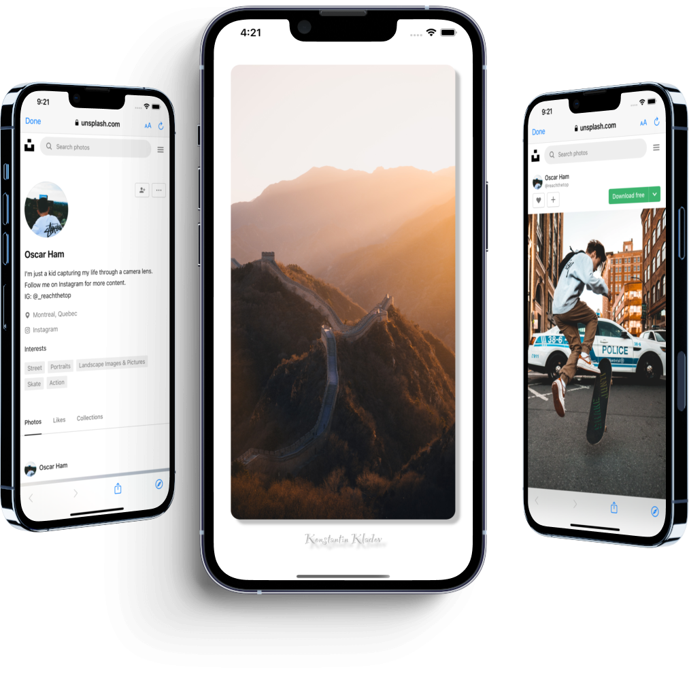
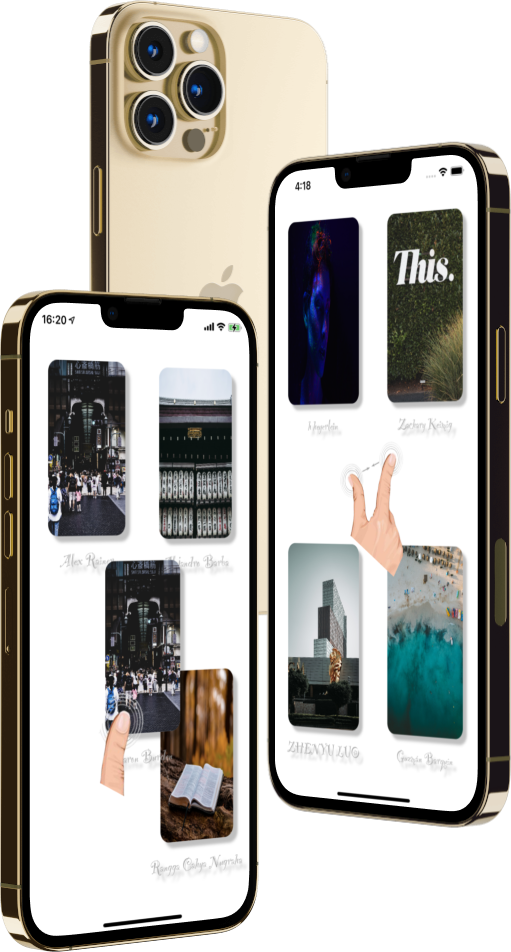

# PhotoGallery

## Introduction

Hi, my name is Aleksandr. I'm glad to see you on my [GitHub](https://github.com/AleksandrBasov?tab=repositories).

## Features

The application is developed in Swift language. I used MVVM architecture in my project.

<h1 align="center">

</h1>

Implemented a gallery of remote photo storage with horizontal scrolling and paging. To each element in gallery was added: rounding of edges, outer shadow, animation of alpha-blending and animation of photo resizing when scrolling, parallax effect. The application is adapted for any orientation. Also, gesture recognition has been added, you can watch them by downloading my application. Have a nice day!

<h1 align="center">

